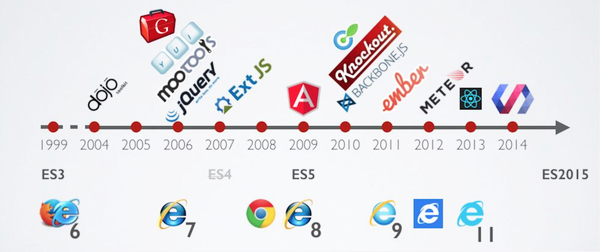

Vue JS - Premier pas
=
Présentation de vue JS
==
Depuis 2010 l'eco-système de Javascript ne cesse d'évoluer.
2010 correspond à l'arrivée de NodeJS (Création officielle en 2009).


Différents frameworks 'front-end' ont vu le jours dans les années qui ont suivies.

* [Histoire des frameworks en Anglais](https://blog.logrocket.com/history-of-frontend-frameworks/)

Nous allons aborder VueJS dans cette formation.


Présentation de VueJS
==

* On prononce 'View'.
* Gratuit et open-source.
* Développé par Evan You.
* Enrichie par la communauté.
* La première version a été release en 2014.

* VueJS est basé sur une programmation déclarative
  * des attributs HTML 
  * des scripts
* VueJS possède une liste étendue de features pour l'affichage
  * Data binding
  * Controllers
  * Pur JS

* Comme avec Angular ou React, une nouvelle stack se propage, la stack MEVN :
  * MongoDB
  * ExpressJS
  * VueJS
  * NodeJS

Pré-requis
==
Avoir npm d'installé

* [Lien pratique si ce n'est pas le cas](https://www.sitepoint.com/beginners-guide-node-package-manager/)

Commencer VueJS
==

Avec VueJS, nous avons deux solutions sur un projet. Le choix va grandement dépendre du cas d'étude :

 * Le projet commence de zéro
 * Le projet est une continuation d'un projet existant.

Nous allons nous baser sur un projet nouveau tout au long de cette formation.

Comme dit précédemment, nous avons deux solutions :

 * Intégrer VueJS comme une bibliothèque sur une page HTML normale
 * Attaquer un projet via le générateur.

Nous allons utiliser le générateur `vue-cli`.

Tout d'abord, il faut installer ce générateur via npm.
```
npm install -g @vue/cli
```
L'option `-g` permet d'installer le générateur globalement sur votre système.
Une fois installé, vous pouvez tester son fonctionnement avec la commande.

```bash
vue --version
```

Félicitation, vous venez d'installer le générateur de base pour chaque projet.
Il est maintenant temps d'attaquer notre projet VueJS.
Mais avant, quelques explications sur la cli de VueJS.

VueJS cli
===
Vous avez installé la CLI, mais qu'est ce que c'est ?
====
`Commande Line Interface`. C'est un générateur en ligne de commande qui va nous
permettre de concevoir nos projets. Angular et React ont aussi des générateurs cli.

Pourquoi utiliser la CLI ?
====

* Harmonisation entre les devs 
* Pratique commune
* Génération automatique
* Qualité
* Bonnes pratiques

Et un bon dev cherchera toujours à réaliser le plus de chose en écrivant le moins possible.

Pour le moment, vous avez installé `vue-cli`. [Ici pour la documentation](https://cli.vuejs.org/guide/)

Cette CLI peut être augmentée avec d'autres plugins. On considère 3 outils dans cette CLI :

* La CLI
* La CLI Service
* La CLI Plugins

La CLI
====
Elle fournit les commandes vue dans le terminal. Elle permet une génération rapide et simple de nouveaux projets via :

```bash
vue create
```

Elle sert aussi à prototyper via :

```bash
vue serve
```

Voire de gérer vos projets par une interface utilisateur
```
vue ui
```

Le CLI Service
====
```
@vue/cli-service
```
Une dépendance de développement seulement, il est ajouté automatiquement avec @vue/cli. Il est construit avec webpack, c'est lui qui fournit les fonctionnalités coeur pour le chargement des plugins, et contient également les binaires pour `serve`, `build` ou encore `inspect`.
...

Le CLI Plugin
====
Ce sont des packages npm, ils fournissent des fonctionnalités additionnelles

* Babel
* Typescript
* ESLint 
* Testing...

Créer le projet
===
Maintenant que l'on a présenté la CLI un peu plus en détails, attaquons le projet.
La CLI permet d'utiliser la commande create pour générer un nouveau projet.

Partons sur le concept de faire une application nommée `my-first-vue-application`

```
vue create my-first-vue-application
```

Après quelques instants, le projet doit être généré.
Gardez les options par défaut pour : babel, eslint


Prendre 10 minutes pour explorer le contenu du projet généré.

Expliquons un peu l'architecture de notre projet.
===

* node_modules/
Dans ce dossier, vous trouverez toutes les bibliothèques
installées.

* public/
Dans ce dossier, vous trouverez toutes les ressources
publiques comme le favicon et index.html.

* package.json
Le fichier qui regroupe toutes les informations du projets.


* src/
Le code de votre application.

Regardons plus en détails le contenu du dossier `src`.

* Un dossier assets
Il contient les ressources nécessaires comme les images.

* Un dossier components
Un dossier simple pour vos composants.

* Un fichier App.vue
Le composant principal du projet.

* Un fichier main.js
Il contient le code de lancement de l'application.

Demo : 15min
====
Explication et présentation des différents fichiers :

* package.json
* main.js ;
* App.vue ;
* components/HelloWorld.vue


-----

  * [En savoir plus sur le package.json](https://flaviocopes.com/package-json/)
    * private : true --> npm refuse de publier le package
    * scripts
      - serve (lance un serveur avec le cli-service)
      - build (compile le projet et le met dans dist)
      - lint (execute l'analyseur de code source)
    * dependences
      - [anecdote sur core-js et le manque de ressources en dev open source](https://www.developpez.com/actu/298476/Que-se-passe-t-il-lorsque-le-responsable-d-une-bibliotheque-JS-telechargee-26-millions-de-fois-par-semaine-va-en-prison-pour-avoir-tue-quelqu-un-avec-une-moto-Core-js-vient-de-le-decouvrir/)

    * dependences-dev : Les dépendances uniquement utilisées lors du développement.
    * browserslist: This configuration means you want to support the last 2 major versions of all browsers with at least 1% of usage (from the CanIUse.com stats), and exclude browsers without official support or updates for 24 months..

-----
